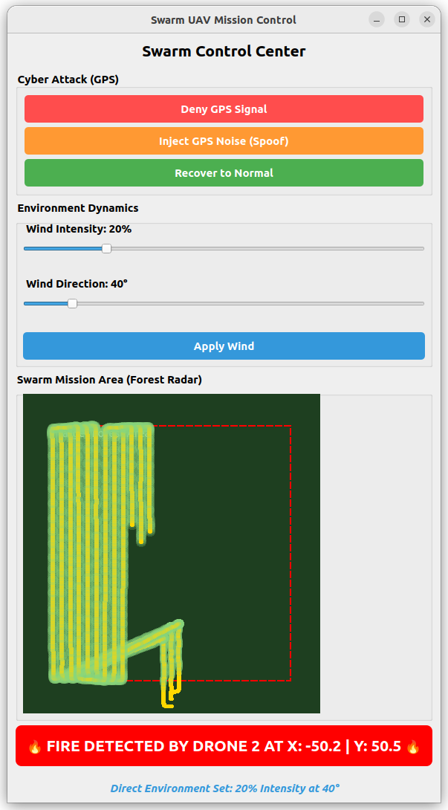

# Swarm UAV Simulation Environment for Forest Fire Detection

This repository contains a standalone, digital twin-based simulation environment for autonomous Swarm UAVs (Unmanned Aerial Vehicles). The system is specifically designed for early forest fire detection using procedurally generated environments, dynamic thermal signatures, and cooperative swarm flight algorithms.

## Key Features

* **Procedural Forest & Fire Generation:** Spawns a randomized forest environment and a dynamic thermal fire signature (Ground Truth) in Gazebo Classic.
* **Unified Comb Sweep Algorithm:** Implements a coordinated, sector-based "Lawnmower" pattern with a 6-meter overlap for zero-blind-spot area scanning. The swarm flies in a locked comb formation.
* **Autonomous Swarm Management:** Built with C++ and MAVSDK, bypassing standard ROS 2 overhead for highly stable, standalone network execution and memory management.
* **Automated Network Cleanup:** Includes a custom launch script to automatically handle zombie UDP processes and MAVLink port conflicts (`Address already in use` errors).
* **Real-time Detection & Telemetry:** Monitors individual UAV FOV (Field of View) footprint and calculates the Euclidean distance to the fire source to trigger automated GUI alerts.

## System Requirements

This project is developed and tested on the following technology stack:
* **OS:** Ubuntu 22.04 LTS
* **Flight Stack:** PX4-Autopilot (SITL)
* **Simulation:** Gazebo Harmonic
* **Dependencies:** MAVSDK (C++), CMake (v3.10+), GCC (C++17)

## Installation & Build Guide

**1. Clone the repository:**
```bash
git clone [https://github.com/Candincer95/swarm-uav-simulation-env.git](https://github.com/Candincer95/swarm-uav-simulation-env.git)
cd swarm-uav-simulation-env

```

**2. Build the Swarm Manager:**

```bash
mkdir build
cd build
cmake ..
make

```

## How to Run the Simulation

**Step 1: Generate a Custom Forest Environment (Optional)**
The repository comes with a default world, but you can procedurally generate a brand new forest with randomized tree placements and a new fire ground-truth location.
Open a terminal in the project root:

```bash
cd build
./Forest_Generator

```

**Step 2: Start the Physical Environment (Gazebo Harmonic & PX4)**
Open a terminal, navigate to your `PX4-Autopilot` directory, and spawn the multi-vehicle simulation. We use the PX4_GZ_WORLD variable to load our custom forest environment:

```bash
export PX4_GZ_WORLD=forest
Tools/simulation/gz/sitl_multiple_run.sh -n 3

```

**Step 2: Execute the Swarm Manager**
Once the drones are spawned in Gazebo, open a new terminal in this repository's root directory. The custom script will clean up any ghost MAVLink ports and safely start the Swarm Manager Node:

```bash
chmod +x launch.sh
./launch.sh

```

*Note: The `launch.sh` script will automatically kill any ghost MAVLink ports (9090, 14581-14583), clean up the network, and safely start the Swarm Manager Node.*

## Graphical User Interface (GUI) & Control Panel

The simulation features a comprehensive, real-time Qt-based GUI that acts as both a "Forest Radar" and an environment control center for robustness testing.



**Key GUI Features & Usage:**

* **Cyber Attack (GPS) Simulation:** To simulate real-world electronic warfare or natural interference, the control panel includes robust testing triggers:
    * **Deny GPS Signal:** Simulates a complete loss of satellite connection to evaluate the swarm's fail-safe behavior.
    * **Inject GPS Noise (Spoof):** Injects artificial error margins into the UAVs' localization data to test formation elasticity.
    * **Recover to Normal:** Instantly restores normal sensor function and telemetry.
* **Environment Dynamics (Wind Injection):** Operators can test the aerodynamic stability of the formation by manually adjusting **Wind Intensity (0% - 100%, where 100% equals 10 m/s physical wind speed)** and **Wind Direction (0° - 360°, where 0° indicates wind blowing exactly from the North)** on the fly using the interactive sliders. A simulated windsock is dynamically spawned within the Gazebo environment to provide real-time, physical visual feedback of the current wind vectors.
* **Live Swarm Radar (Visualizer):** The radar panel dynamically draws the thermal scanning footprints (yellow paths) of the UAVs in real-time. This allows operators to visually verify the 6-meter overlap and ensure no blind spots remain during the unified comb sweep.
* **Autonomous Fire Alert System:** Once a UAV's Field of View intersects with the fire's ground truth coordinates, the GUI automatically triggers a prominent **"FIRE DETECTED"** alert banner at the bottom, pinpointing the exact discovering drone and the precise X/Y location of the hazard.

## Architecture & Mathematical Modeling

* **Geodetic Coordinate Conversion:** The simulation translates Cartesian coordinates (meters) to WGS84 Geodetic coordinates (Latitude/Longitude) in real-time. It utilizes a custom cosine scaling factor ($\approx 75440$ meters/degree) to adjust for the longitudinal narrowing at the Gazebo origin (Zurich, $47.39^{\circ}$ N).
* **Sensor Footprint Geometry:** The swarm overlap margin is mathematically calculated based on a 25m operational altitude and the simulated thermal camera FOV footprint, ensuring a 20% safety overlap margin to eliminate blind spots
